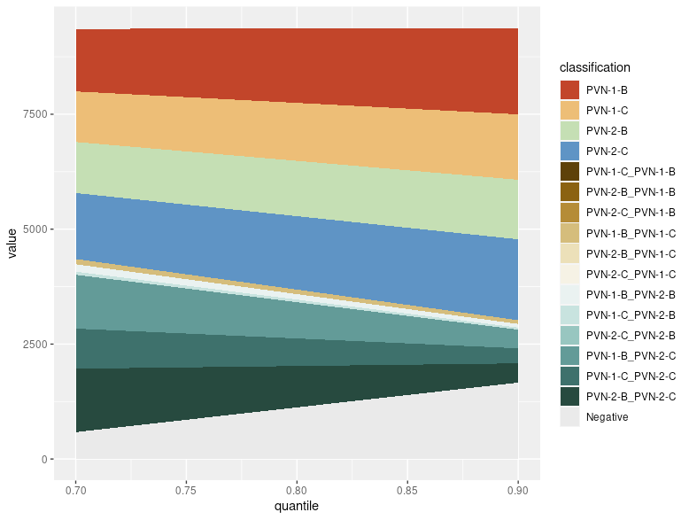

<!-- README.md is generated from README.Rmd. Please edit that file -->

# SCOPfunctions

<!-- badges: start -->

<!-- badges: end -->

An R package of functions for single cell -omics analysis. Fits into
Seurat workflow.

## Install

### Install using devtools:

    devtools::install_github("CBMR-Single-Cell-Omics-Platform/SCOPfunctions")

### install manually

    git clone https://www.github.com/CBMR-Single-Cell-Omics-Platform/SCOPfunctions.git 

then from R:

    install.packages("./SCOPfunctions", type="source", repos=NULL)

## Usage

    library("SCOPfunctions")
    library("Seurat")

Download the example data used in the Seurat hashing vignette at
<https://satijalab.org/seurat/archive/v3.1/hashing_vignette.html>

Follow the initial steps of the hashing vignette up till and including
the HTO normalization

### Preprocess

Generate an area plot showing how proportions of singlets, doublets and
negatives vary with the positive quantile

    p_quantile = SCOPfunctions::prep_HTO_q_area_plot(
      seurat_obj=pbmc.hashtag,
      vec_range_quantile=seq(0.8,0.99,0.01),
      n_cores_max=Inf
    ) 

 infer intra-hash doublets

    # First demultiplex hashtags 
    q = 0.98
    pbmc.hashtag = Seurat::HTOdemux(pbmc.hashtag,assay = "HTO", positive.quantile = q)
    
    # use inter-hash doublets to infer intra-hash doublets
    pbmc.hashtag = SCOPfunctions::prep_intrahash_doub(
      seurat_obj=pbmc.hashtag,
      assay = "RNA",
      npcs=20,
      randomSeed = 12345
    ) 

Do QC on RNA assay

    pbmc.hashtag  = prep_qc_rna(
      seurat_obj=pbmc.hashtag,
      assay = "RNA"
      )

### Differential expression

``` 

# first find clusters (after normalizing the RNA, finding variable features and scaling the data - not shown)
pbmc.hashtag <- FindNeighbors(pbmc.hashtag, reduction = "pca", dims = 1:20)
pbmc.hashtag <- FindClusters(pbmc.hashtag, resolution = 10, verbose = FALSE)

# find DE genes for cluster 0
df_DE = SCOPfunctions::DE_MAST_RE_seurat(
  object=pbmc.hashtag,
  random_effect.vars="hash.ID",
  test.use = "MAST",
  ident.1 = "0",
  group.by = "seurat_clusters"
)
```

find the activity values for a geneset

``` 

# as an example, just use the top DE genes for cluster 0
vec_geneWeights <- seq(from = 1, to = 0.1, by = -0.1)
vec_geneWeights <- vec_geneWeights/sum(vec_geneWeights)

names(vec_geneWeights) =  head(rownames(df_DE), 10)

pbmc.hashtag$my_geneset_embeddings <- geneset_embed(
  mat_datExpr = as.matrix(GetAssayData(pbmc.hashtag, slot="scale.data", assay="SCT")),
  vec_geneWeights=vec_geneWeights,
  min_feats_present = 5)
```

find the activity values for a list of genesets

``` 

pbmc.hashtag <- geneset_embed_list_seurat(
  seurat_obj = pbmc.hashtag,
  list_vec_geneWeights=list_vec_geneWeights,
  slot="scale.data",
  assay="SCT",
  min_feats_present = 5,
  n_cores_max = Inf)
```

### Plot results

plot the distribution of cell clusters in different samples

    plot_barIdentGroup(seurat_obj=pbmc.hashtag,
                        var_ident="sample_ID",
                        var_group="cluster",
                        vec_group_colors=NULL,
                        f_color=colorRampPalette(brewer.pal(n=11, name="RdYlBu")),
                        do_plot = F)


plot a cluster \* feature grid of gene expression violin plots

    # Here we just use the top variable genes, but normally we would use cluster marker genes
    plot_vlnGrid(seurat_obj,
                  slot="data",
                  var_group="cluster",
                  vec_features=head(VariableFeatures(seurat_obj),n=15),
                  vec_group_colors=NULL,
                  f_color = colorRampPalette(brewer.pal(n=11, name="RdYlBu")))


make a network plot of a set of co-expressed features

    SCOPfunctions::plot_network(
      mat_datExpr=as.matrix(GetAssayData(seurat_obj, slot="data")),
      vec_geneImportance=vec_geneImportance,
      vec_genes_highlight=c(),
      n_max_genes=50,
      igraph_algorithm = "drl",
      fontface_labels="bold.italic",
      color_edge = "grey70",
      edge_thickness = 1)


## Contribute

Issues and pull requests are welcome\! All contributions should be in
line with the [usethis code of
conduct](https://usethis.r-lib.org/CODE_OF_CONDUCT.html). This package
uses the methods and R tools set out in [R
packages](https://r-pkgs.org/intro.html). All Pull Requests should
follow the [tidyverse style
guide](https://style.tidyverse.org/documentation.html).
